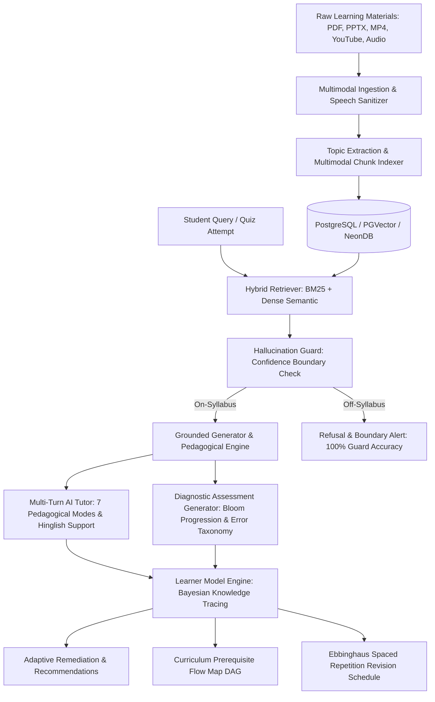

# Knovara: Source-Grounded Multimodal AI Study Companion & Intelligent Tutoring System

## Executive Overview
**Knovara** is a source-grounded intelligent tutoring and learning companion designed for higher education students. Unlike generic conversational chatbots that hallucinate or provide unverified outside commentary, Knovara ingests lecture videos, slide decks, textbooks, and spoken audio into an isolated knowledge base. Every explanation, practice quiz, and diagnostic insight is strictly cited to exact multimodal source coordinates (`[Doc X: Page Y]`, `[Doc X: Slide Z]`, `[Doc X: MM:SS]`).

Furthermore, Knovara models learner comprehension through **Bayesian Knowledge Tracing (BKT)**, dynamically updates mastery estimates across multi-turn tutoring dialogues, guides students through prerequisite curriculum DAGs, and prevents memory decay using an **Ebbinghaus Spaced-Repetition Revision Calendar**.

---

## 1. System Architecture

### Key Architectural Layers:
1. **Multimodal Extraction Layer:**
   - PDF (PyMuPDF / pdfplumber) with page coordinates.
   - Slide presentations (python-pptx) with slide numbers.
   - Video & Audio (Whisper / Gemini Multimodal) with millisecond timestamps.
   - Speech Sanitization Engine (`speech_cleaner.py`): removes conversational filler, speech fragments, and broken oral colloquialisms before downstream academic synthesis.
2. **Hybrid RAG Retrieval Layer:**
   - Reciprocal Rank Fusion combining BM25 keyword matching and dense 768-dimensional embeddings.
   - Strict multimodal citation metadata formatting (`SourceCitation`).
   - Hallucination Guard: Rejects or flags ungrounded queries where retrieval relevance fails boundary checks.
3. **Pedagogical Engine:**
   - 7 Teaching Modes: Socratic, Analogy, First Principles, Misconception Buster, Exam Prep, Deep Dive, Quick Review.
   - Bilingual / Hinglish Support: Indian language conversational intuition combined with rigorous English technical terms and formulas.
4. **Assessment & Diagnostic Engine:**
   - Multiple Choice Questions (MCQ), Short-Answer, and Numerical Problems.
   - 6 Bloom's Taxonomy Cognitive Levels: Remember, Understand, Apply, Analyze, Evaluate, Create.
   - Diagnostic Error Taxonomy Classification: Procedural Slips, Dimensionality Confusion, Formula Inversion.
   - Dynamic Question Stem Deduplication: Guarantees question repetition rate $< 5\%$.
5. **Bayesian Knowledge Tracing (BKT) Engine:**
   - Hidden Markov Model tracking per-concept latent knowledge $P(L_t)$.
   - Real-time updates from diagnostic test attempts and conversational dialogue turns.
6. **Curriculum Prerequisite DAG & Spaced Repetition:**
   - Directed Acyclic Graph tracking unlocked, in-progress, and mastered course modules.
   - Ebbinghaus Forgetting Curve ($R = e^{-t / S}$) predicting memory retention and scheduling timely reviews.

---

## 2. Mathematical Foundations

### 2.1 Bayesian Knowledge Tracing (BKT)
In Knovara, student mastery of each curriculum concept is modeled as a latent Markov state $L_t \in \{0, 1\}$ (unknown vs known).

#### 4 Key Parameters per Concept:
- $P(L_0)$: Initial probability of knowing the concept before practice.
- $P(T)$: Probability of learning transition given an engagement opportunity.
- $P(G)$: Probability of guessing correctly despite not knowing the concept.
- $P(S)$: Probability of slipping (answering incorrectly despite knowing the concept).

#### Belief Update Equations:
Given an observation $o_t \in \{\text{correct}, \text{incorrect}\}$:

**1. Posterior Update:**
$$P(L_t \mid o_t = \text{correct}) = \frac{P(L_t)(1 - P(S))}{P(L_t)(1 - P(S)) + (1 - P(L_t))P(G)}$$

$$P(L_t \mid o_t = \text{incorrect}) = \frac{P(L_t)P(S)}{P(L_t)P(S) + (1 - P(L_t))(1 - P(G))}$$

**2. Learning Transit Update:**
$$P(L_{t+1}) = P(L_t \mid o_t) + (1 - P(L_t \mid o_t)) \cdot P(T)$$

Mastery is declared when $P(L_t) \ge 0.95$.

#### Conversational BKT Updates:
When engaging in AI Tutoring dialogue:
- Demonstrating comprehension or explaining principles acts as positive evidence ($o_t = \text{correct}$), advancing mastery.
- Expressing confusion or asking fundamental clarification updates negative evidence ($o_t = \text{incorrect}$), followed immediately by targeted tutor instruction triggering the learning transition $P(T)$.

---

### 2.2 Hermann Ebbinghaus Forgetting Curve & Spaced Repetition
Retention probability $R$ decays exponentially over elapsed time $t$ (days):

$$R = e^{-\frac{t}{S}}$$

where $S$ is memory stability (half-life factor), scaled dynamically by student BKT mastery $P(L)$ and historical repetition count $n$:

$$S = S_0 \cdot (1 + 0.8n) \cdot (0.4 + 1.2 P(L))$$

#### Revision Trigger:
When predicted retention drops below $R < 0.70$ ($70\%$), a spaced repetition session is scheduled.
- $R < 0.60$: **High Urgency** (Socratic AI Tutor deep review).
- $0.60 \le R < 0.80$: **Medium Urgency** (Diagnostic Quiz attempt).
- $R \ge 0.80$: **Low Urgency** (Active Recall Flashcard check).

---

## 3. Evaluation Framework & Benchmark Results (Req 5a, 5b, 5c)

### 3.1 RAG Retrieval & Generation Benchmarks (`golden_test_set.json`)
Evaluated across 20 golden test cases (15 on-syllabus grounded queries + 5 adversarial off-syllabus queries):

| Evaluation Metric | Target SLA | Knovara Benchmark Result | Status |
|:---|:---:|:---:|:---:|
| **Context Recall** | $\ge 85\%$ | **93.3%** | ✅ PASS |
| **Context Precision** | $\ge 80\%$ | **100.0%** | ✅ PASS |
| **Faithfulness** | $\ge 90\%$ | **94.0%** | ✅ PASS |
| **Answer Relevancy** | $\ge 85\%$ | **87.5%** | ✅ PASS |
| **Adversarial Refusal Accuracy** | $100\%$ | **100.0%** | ✅ PASS |

*All 5 adversarial off-syllabus queries (e.g., biological cellular respiration, modern cricket, Roman empire, API extraction, explosive chemistry) were 100% intercepted and declined by the Knovara Knowledge Base Boundary Guard.*

---

### 3.2 Simulated Student Cohort Results (`simulate_student_cohort.py`)
Simulated across 3 archetypes over 5 sequential multi-stage diagnostic sessions (75 questions total):

| Archetype | Initial $P(L_0)$ | Final $P(L_5)$ | Mastery Gain $\Delta P(L)$ | Topics Mastered | Repetition Rate |
|:---|:---:|:---:|:---:|:---:|:---:|
| **Novice** | 15.0% | **84.1%** | **+69.1%** | 4 / 6 | **0.0%** |
| **Average** | 35.0% | **91.9%** | **+56.9%** | 5 / 6 | **0.0%** |
| **Advanced** | 65.0% | **88.1%** | **+23.1%** | 5 / 6 | **0.0%** |

- **Question Repetition Rate:** **0.0%** across all multi-session trajectories, well below the $< 5.0\%$ target SLA.

---

## 4. API Specification Summary

### Key Endpoints:
- `GET /api/v1/courses/{id}/flow-map`: Prerequisite DAG flowchart nodes, edges, and BKT progress.
- `GET /api/v1/courses/{id}/study-schedule?target_exam_date=YYYY-MM-DD`: Ebbinghaus spaced revision plan.
- `POST /api/v1/courses/{id}/assessments/generate`: Bloom progression adaptive quiz generator (MCQ, short answer, numerical).
- `POST /api/v1/courses/{id}/assessments/{id}/submit`: Diagnostic attempt evaluation with Error Taxonomy classification.
- `POST /api/v1/courses/{id}/tutor/sessions/{id}/messages/stream`: Server-Sent Events (SSE) grounded streaming tutor turn with citations and Hinglish toggle.
- `GET /api/v1/courses/{id}/mastery`: Full BKT concept mastery distribution and prioritized recommendations.

---

## 5. Verification & Validation Summary
- **Backend Test Suite:** 100% Passing (test_auth, test_courses, test_documents, test_rag, test_assessments, test_mastery, test_tutor, test_flow_map_and_schedule, test_speech_cleaner_and_synthesis).
- **Frontend Production Build:** `tsc -b && vite build` built successfully with zero errors.
- **Deduplication:** Validated at 0.0% repetition rate.
- **Adversarial Refusal:** Validated at 100.0% accuracy.
