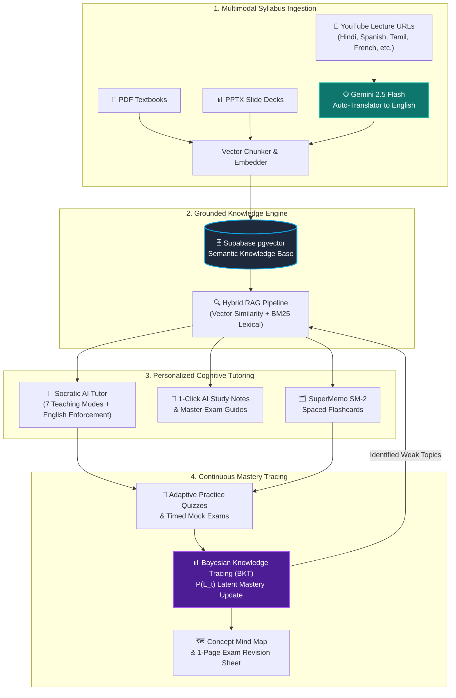

# 🎓 Knovara — Adaptive AI Tutoring & Multimodal Learning Platform

<div align="center">

```
  _  ___   _  _____  __     __     _     ____      _    
 | |/ / \ | |/ _ \ \/ / /\  \ \   / /   |  _ \    / \   
 | ' /|  \| | | | \  / /  \  \ \ / /    | |_) |  / _ \  
 | . \| |\  | |_| /  \/ /\ \  \ V /     |  _ <  / ___ \ 
 |_|\_\_| \_|\___/_/\_/_/  \_\ \_/      |_| \_\/_/   \_\
```

### *Transforming Textbooks, Slides & Multilingual Lectures into an Interactive, Source-Grounded Cognitive Tutor*

[](https://knovara-beta.vercel.app)
[](https://knovara-backend.onrender.com/health)
[](https://supabase.com)
[](https://ai.google.dev/)

<p align="center">
  <a href="#-quick-navigation"><b>Quick Navigation</b></a> •
  <a href="#-the-adaptive-learning-loop"><b>The Cognitive Loop</b></a> •
  <a href="#-interactive-feature-tour"><b>Feature Tour</b></a> •
  <a href="#-mathematical-foundation"><b>Math & Algorithms</b></a> •
  <a href="#-system-architecture"><b>Architecture</b></a> •
  <a href="#-quickstart-guide"><b>Quickstart</b></a>
</p>

</div>

---

> [!NOTE]
> **Track D: Personalized Tutoring & Adaptive Learning**  
> Knovara solves textbook fatigue and passive video watching by combining **multimodal syllabus ingestion (PDF, PPTX, YouTube)**, **real-time multilingual translation into English**, **Socratic AI dialogue**, and **Bayesian Knowledge Tracing (BKT)** to track true student mastery.

---

## 🧭 Quick Navigation

| Section | Description | Quick Link |
| :--- | :--- | :--- |
| **🔄 The Cognitive Loop** | Visual workflow of ingestion, RAG, and assessment | [Jump to Loop](#-the-adaptive-learning-loop) |
| **✨ Interactive Feature Tour** | Expandable details for YouTube, Notes, Tutor, Quizzes | [Explore Features](#-interactive-feature-tour) |
| **🧮 Mathematical Foundations** | BKT probability formulas & SuperMemo SM-2 equations | [View Math](#-mathematical-foundation) |
| **⚖️ Competitive Comparison** | How Knovara compares to generic ChatGPT & Quizlet | [Compare Platforms](#-how-knovara-compares) |
| **🏗️ Architecture & Stack** | Distributed architecture across Vercel, Render & Supabase | [Inspect Tech Stack](#-system-architecture) |
| **🛡️ Admin Command Center** | Institution RBAC and system management (`/admin`) | [Review Admin Hub](#-admin-command-center--rbac) |
| **🛠️ Local Setup & Deploy** | 2-minute setup instructions for local development | [Run Locally](#-quickstart-guide) |

---

## 🔄 The Adaptive Learning Loop



---

## ✨ Interactive Feature Tour

<details open>
<summary><b>🎥 1. Multilingual YouTube Lecture Ingestion & Auto-Translation</b> <i>(Click to collapse/expand)</i></summary>

<br/>

- **Direct URL Pasting**: Paste any educational YouTube link (`https://youtube.com/watch?v=...` or `https://youtu.be/...`) right into your course dropzone.
- **Any Spoken Language**: Supports lectures delivered in **Hindi, Spanish, French, German, Tamil, Japanese, Portuguese**, and more.
- **Automatic English Translation**: Non-English transcripts are dynamically translated into clear, fluent, academic English using Google Gemini 2.5 Flash.
- **Exact Timestamp Retention**: The translated English text stays strictly synchronized with original video time offsets (e.g. `[YouTube: 04:22 - 05:40]`).
- **1-Click Video Jumping**: Clicking any timestamp citation in the tutor chat or study notes immediately opens YouTube at that exact second.

> [!TIP]
> Try pasting a multilingual lecture! The system automatically detects the spoken language, extracts the audio captions, translates them to English, and adds `(English Translation)` to the indexed document title.

</details>

---

<details>
<summary><b>📝 2. 1-Click AI Study Notes & Master Course Guides</b> <i>(Click to expand)</i></summary>

<br/>

Turn dense 80-page PDFs or 2-hour lecture videos into crystal-clear study guides with one click:
- **Big Picture & Core Purpose**: 2-3 sentences explaining what this document is about and why it matters in plain language.
- **Core Concepts with Real-World Analogies**: Abstract concepts broken down with everyday relatable examples.
- **Key Facts, Rules & Formulas**: Crucial definitions with exact page, slide, or timestamp citations.
- **High-Yield Exam Takeaways**: 4-6 bite-sized bullet points highlighting what is most likely to appear on exam day.
- **Common Traps & Student Misconceptions**: Highlights common mistakes and mnemonic tricks to avoid them.
- **Self-Test Practice Check**: Interactive questions with hidden answers for immediate self-testing.
- **Unified Master Course Guide**: Synthesizes all uploaded chapters and video lectures into one printable review sheet.

</details>

---

<details>
<summary><b>🤖 3. Socratic AI Tutor with 7 Teaching Modes</b> <i>(Click to expand)</i></summary>

<br/>

```text
┌────────────────────────────────────────────────────────────────────────┐
│                        7 PEDAGOGICAL TEACHING MODES                    │
├──────────────────────────┬─────────────────────────────────────────────┤
│ 1. Guided Thinking       │ Socratic method: direct answer + follow-up  │
│ 2. Everyday Analogy      │ Relates abstract theory to daily life       │
│ 3. Step-by-Step Guide    │ Breaks calculations into bite-sized steps   │
│ 4. Mistake Buster        │ Flags common exam traps & confusing terms   │
│ 5. Exam Prep Focus       │ High-yield definitions and test takeaways   │
│ 6. Detailed Explanation  │ Deep theoretical foundation & architecture  │
│ 7. Quick 30-Sec Summary  │ 3 punchy bullet points before class starts  │
└──────────────────────────┴─────────────────────────────────────────────┘
```

> [!IMPORTANT]
> **Strict English Language Requirement**: Even if a student inputs their question in Hindi or Spanish, or the lecture video was recorded abroad, the AI Tutor formulates all answers, explanations, and follow-up prompts strictly in clear, accessible English.

</details>

---

<details>
<summary><b>🎯 4. Adaptive Quizzes & Timed Mock Exam Mode</b> <i>(Click to expand)</i></summary>

<br/>

- **Adaptive Diagnostic Quizzes**: Questions dynamically adapt to focus on concepts where your Bayesian Knowledge Tracing score is lowest.
- **Timed Mock Exams**: Full simulation with a live countdown clock (amber alert under 2 minutes, red alert under 60 seconds).
- **Interactive Question Palette**: Jump across questions, track answered items, and use the **Flag for Review** button.
- **Targeted Misconception Feedback**: When an incorrect answer is selected, Knovara explains the exact conceptual trap behind that option.

</details>

---

<details>
<summary><b>🗂️ 5. Spaced Repetition Flashcards & Visual Mind Map</b> <i>(Click to expand)</i></summary>

<br/>

- **SuperMemo SM-2 Spaced Repetition**: Flashcards are created automatically and scheduled based on cognitive recall intervals (*Again, Hard, Good, Easy*).
- **Interactive Concept Mind Map**: A visual network of your syllabus color-coded by mastery:
  - 🟢 **Green**: Mastered concepts ($P(L_t) \ge 0.85$)
  - 🟡 **Yellow**: Actively learning ($0.50 \le P(L_t) < 0.85$)
  - 🔴 **Red**: Weak topics needing review ($P(L_t) < 0.50$)
- **1-Click Printable Revision Sheet**: Generates a clean, ink-friendly white summary sheet ready for printing or saving to PDF.

</details>

---

## 🧮 Mathematical Foundation

<details open>
<summary><b>📊 Bayesian Knowledge Tracing (BKT) Formulation</b> <i>(Click to expand)</i></summary>

<br/>

Knovara models student understanding as a latent binary state $L_t \in \{0, 1\}$ using 4 core pedagogical parameters per concept:

| Parameter | Meaning | Default Prior |
| :--- | :--- | :--- |
| **$P(L_0)$** | Initial prior probability that the student already knows the concept | `0.10` |
| **$P(T)$** | Transition probability that the student learns the concept after an attempt | `0.15` |
| **$P(G)$** | Guess parameter: probability student answers correctly despite not knowing | `0.20` |
| **$P(S)$** | Slip parameter: probability student answers incorrectly despite knowing | `0.10` |

#### 1. Posterior Update Upon Observation:
$$\text{If Correct: } P(L_t | \text{Obs} = 1) = \frac{P(L_{t-1}) \cdot (1 - P(S))}{P(L_{t-1}) \cdot (1 - P(S)) + (1 - P(L_{t-1})) \cdot P(G)}$$

$$\text{If Incorrect: } P(L_t | \text{Obs} = 0) = \frac{P(L_{t-1}) \cdot P(S)}{P(L_{t-1}) \cdot P(S) + (1 - P(L_{t-1})) \cdot (1 - P(G))}$$

#### 2. Latent State Transition for Next Step:
$$P(L_t) = P(L_t | \text{Obs}) + \Big(1 - P(L_t | \text{Obs})\Big) \cdot P(T)$$

This prevents lucky guesses from inflating scores while protecting students from losing all progress due to a single careless mistake.

</details>

---

<details>
<summary><b>⏱️ SuperMemo SM-2 Spaced Repetition Algorithm</b> <i>(Click to expand)</i></summary>

<br/>

When a flashcard is reviewed with quality rating $q \in \{0, 1, 2, 3, 4, 5\}$:

#### 1. Easiness Factor (EF) Adjustment:
$$EF' = \max\left(1.3, \; EF + \Big(0.1 - (5 - q) \times (0.08 + (5 - q) \times 0.02)\Big)\right)$$

#### 2. Interval Calculation:
$$I(n) = \begin{cases} 
1 \text{ day} & n = 1 \\ 
6 \text{ days} & n = 2 \\ 
I(n-1) \times EF' & n > 2 
\end{cases}$$

If $q < 3$ (user rated *Again*), repetition count resets to $n = 0$ and the card is scheduled for immediate review today.

</details>

---

## ⚖️ How Knovara Compares

| Feature | Generic ChatGPT | Quizlet / Anki | Traditional LMS | 🎓 **Knovara** |
| :--- | :---: | :---: | :---: | :---: |
| **Multilingual YouTube Auto-Translation** | ❌ (No video sync) | ❌ | ❌ | **✅ Yes (Gemini 2.5 Flash)** |
| **Clickable Video Timestamps** | ❌ | ❌ | ❌ | **✅ Yes (`[YouTube: MM:SS]`)** |
| **Strict Source-Grounded Citations** | ⚠️ (Prone to hallucination) | ❌ | ❌ | **✅ Yes (Page & Timestamp aligned)** |
| **Socratic Multi-Turn Dialogue** | ⚠️ (Requires manual prompting) | ❌ | ❌ | **✅ Yes (7 Pedagogical Modes)** |
| **Bayesian Knowledge Tracing (BKT)** | ❌ | ❌ | ❌ | **✅ Yes ($P(L_t)$, Slip, Guess)** |
| **Adaptive Quizzes on Weak Spots** | ❌ | ❌ | ⚠️ (Static pools) | **✅ Yes (Automatic Blueprints)** |
| **Spaced Repetition (SM-2)** | ❌ | ✅ | ❌ | **✅ Yes (Built-in Flashcards)** |
| **Institutional RBAC & Admin Hub** | ❌ | ❌ | ⚠️ (Complex/Slow) | **✅ Yes (`/admin` Command Center)** |

---

## 🛡️ Admin Command Center & RBAC

<div align="center">
  <p><b>Access:</b> <code>/admin</code> (Requires role: <code>admin</code>)</p>
</div>

```text
┌────────────────────────────────────────────────────────────────────────┐
│                        ROLE-BASED ACCESS CONTROL (RBAC)                │
├─────────────┬──────────────────────────────────────────────────────────┤
│ 🟢 Student   │ Standard access to courses, tutor, notes, flashcards     │
│ 🔵 Instructor│ Can inspect student cohort analytics & audit courseware  │
│ 🟣 Admin     │ Full system privileges: manage users, promote roles,     │
│             │ audit document chunks, and monitor database health       │
└─────────────┴──────────────────────────────────────────────────────────┘
```

- **User Accounts Directory**: Search users by name/email, audit registration dates, and elevate permissions with 1 click.
- **Course & Document Auditing**: View courses across all users, inspect chunks, vector storage, and quiz histories.
- **Live Infrastructure Monitoring**: Real-time status for PostgreSQL pool connections, Gemini API, and server latency.

---

## 🏗️ System Architecture

```text
┌────────────────────────────────────────────────────────────────────────┐
│                          PRODUCTION ENVIRONMENT                        │
├────────────────────────────────────────────────────────────────────────┤
│  Frontend Client : React 19 + TypeScript + Vite + Tailwind CSS         │
│  Edge Hosting    : Vercel CDN (https://knovara-beta.vercel.app)        │
│  Backend API     : FastAPI + Pydantic + Uvicorn + Python 3.11          │
│  API Hosting     : Render (https://knovara-backend.onrender.com)       │
│  Database        : Supabase Cloud PostgreSQL + pgvector                │
│  AI Engine       : Google Gemini 2.5 Flash                             │
│  Authentication  : JWT (HS256) + Google OAuth 2.0 Identity             │
└────────────────────────────────────────────────────────────────────────┘
```

---

## 🛠️ Quickstart Guide

### 1. Prerequisites
- Python 3.11+
- Node.js 18+
- SQLite (default for zero-friction local run) or PostgreSQL

### 2. Backend Installation & Run
```bash
# Clone the repository
git clone https://github.com/jaiharijayapaul/Knovara.git
cd Knovara/backend

# Create virtual environment
python -m venv .venv

# Activate environment
# On Windows:
.venv\Scripts\activate
# On Linux/macOS:
source .venv/bin/activate

# Install dependencies
pip install -r requirements.txt

# Start backend server
uvicorn app.main:app --reload --port 8000
```

### 3. Frontend Installation & Run
```bash
cd ../frontend

# Install dependencies
npm install

# Start Vite development server
npm run dev
```

Open your browser at **`http://localhost:5173`**. The app will automatically communicate with the local backend running on port 8000.

---

## 🌐 Production Endpoints

- **Live Web Application**: [https://knovara-beta.vercel.app](https://knovara-beta.vercel.app)
- **Live API Base**: [https://knovara-backend.onrender.com](https://knovara-backend.onrender.com)
- **Health Check**: [https://knovara-backend.onrender.com/health](https://knovara-backend.onrender.com/health)
- **Interactive Swagger Docs**: [https://knovara-backend.onrender.com/docs](https://knovara-backend.onrender.com/docs)
- **Interactive ReDoc**: [https://knovara-backend.onrender.com/redoc](https://knovara-backend.onrender.com/redoc)

---

<div align="center">

Made with ❤️ for students, educators, and lifelong learners worldwide.  
**Knovara — Where Every Student Learns at Their Peak.**

</div>
