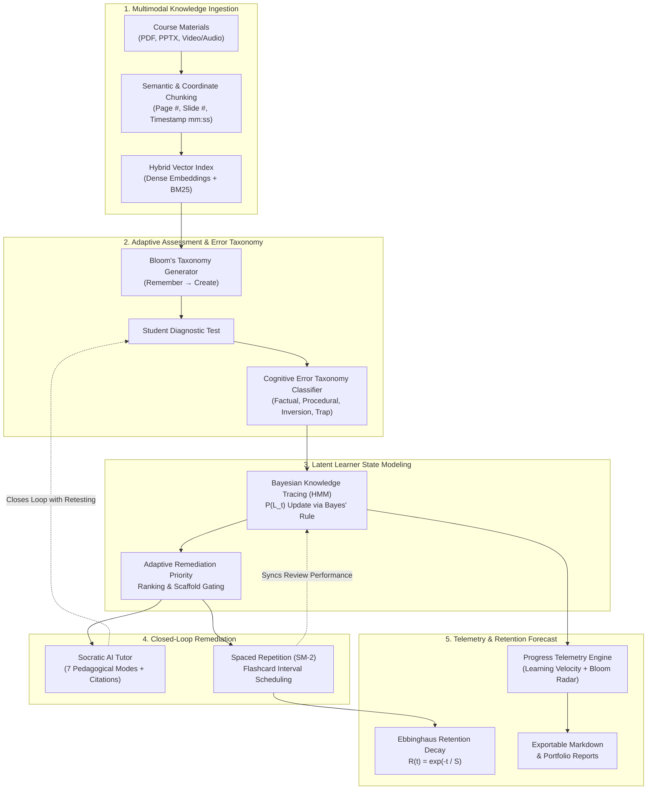

# 🎓 Knovara — Final Project Defense & Architectural Manual

This document provides a comprehensive, rigorous technical breakdown of **Knovara**, an AI-powered personalized tutoring and adaptive learning platform. It is prepared for academic evaluation, final year project defense, and technical demonstrations.

---

## 1. Executive Summary & Problem Formulation

Traditional Computer-Assisted Learning (CAL) systems suffer from three fundamental limitations:
1. **Unverifiable Hallucinations**: Standard LLM-based tutors generate plausible yet unverified claims disconnected from authoritative course syllabi.
2. **Coarse Psychometrics**: Standard testing platforms measure binary correctness (right vs. wrong) rather than diagnosing underlying cognitive misconceptions or measuring multi-tier cognitive progression.
3. **Open-Loop Disconnection**: Assessment failures rarely inform immediate conversational instruction; testing and tutoring remain fragmented silos.

**Knovara** addresses these challenges through a unified **Closed-Loop Pedagogical Architecture** combining:
- **Multimodal Coordinate Retrieval-Augmented Generation (RAG)**: Physical coordinates down to exact PDF pages, PPTX slide numbers, and video timestamps ($mm:ss$).
- **7-Mode Socratic AI Tutor**: Probing inquiries that scaffold understanding rather than giving away answers.
- **Bloom's Revised Taxonomy Question Progression**: Dynamic cognitive scaling from *Remembering* to *Creating*.
- **Cognitive Error Taxonomy**: Real-time diagnostic categorization of student mistakes (*Factual Misconception*, *Procedural Slip*, *Formula Inversion*, *Dimensionality Confusion*, *Unchecked Assumption*).
- **Bayesian Knowledge Tracing (BKT)**: Hidden Markov Models tracking continuous latent concept mastery ($P(L)$) updated after every interaction.
- **SuperMemo-2 (SM-2) Spaced Repetition**: Memory retention scheduling bidirectionally synchronised with BKT.
- **Multidimensional Learning Telemetry & Ebbinghaus Retention Forecasts**: Real-time progress analytics and exportable portfolios.

---

## 2. End-to-End System Architecture

---

## 3. Mathematical & Algorithmic Foundations

### 3.1 Bayesian Knowledge Tracing (BKT) Hidden Markov Model

Knovara models learner mastery of each concept $k$ as a two-state Hidden Markov Model where the latent state is binary: $L_t \in \{0 (\text{Unmastered}), 1 (\text{Mastered})\}$.

#### Four Core Hyperparameters:
- $P(L_0)$: Prior probability of knowing the concept before practice (default: $0.30$).
- $P(T)$: Transition probability of learning the concept between opportunities (default: $0.25$).
- $P(G)$: Guess probability — answering correctly despite not knowing (default: $0.15$).
- $P(S)$: Slip probability — answering incorrectly despite knowing (default: $0.10$).

#### Bayesian Posterior Update:
When a learner attempts a question associated with concept $k$ at step $t$:

$$\text{If Correct: } P(L_t \mid \text{obs}=1) = \frac{P(L_{t-1}) \cdot (1 - P(S))}{P(L_{t-1}) \cdot (1 - P(S)) + (1 - P(L_{t-1})) \cdot P(G)}$$

$$\text{If Incorrect: } P(L_t \mid \text{obs}=0) = \frac{P(L_{t-1}) \cdot P(S)}{P(L_{t-1}) \cdot P(S) + (1 - P(L_{t-1})) \cdot (1 - P(G))}$$

#### Latent Knowledge Transition for Step $t+1$:

$$P(L_{t+1}) = P(L_t \mid \text{obs}) + (1 - P(L_t \mid \text{obs})) \cdot P(T)$$

When $P(L_{t+1}) \ge 0.85$, the concept is classified as **Mastered**.

---

### 3.2 SuperMemo-2 (SM-2) Spaced Repetition Engine

Flashcard intervals and stability are computed via the classic SM-2 algorithm:

$$\text{Ease Factor: } EF' = \max\left(1.3, EF + (0.1 - (5 - q) \cdot (0.08 + (5 - q) \cdot 0.02))\right)$$

Where $q \in \{0, 1, 2, 3, 4, 5\}$ represents student recall quality:
- If $q < 3$ (Failure): $\text{Repetitions} = 0$, $\text{Interval} = 1\text{ day}$ (Flags memory lapse).
- If $q \ge 3$ (Success):
  - Repetition 1: $\text{Interval} = 1\text{ day}$
  - Repetition 2: $\text{Interval} = 6\text{ days}$
  - Repetition $n \ge 3$: $\text{Interval}_n = \text{Interval}_{n-1} \times EF'$

#### Ebbinghaus Retention Forecast:
Projected memory retention probability at day offset $t$:

$$R(t) = \exp\left(-\frac{t}{S}\right), \quad S = \text{Interval} \cdot \frac{EF'}{2.5}$$

---

### 3.3 Bloom's Revised Taxonomy Question Progression

Every assessment question is mapped to one of the 6 cognitive tiers:
1. **Remembering**: Verbatim terminology, definitions, formulas, coordinate coordinates.
2. **Understanding**: Conceptual paraphrasing, translating equations, classifying models.
3. **Applying**: Numerical calculation, executing derivations, applying models to scenarios.
4. **Analyzing**: Contrasting algorithms, diagnosing bias/variance, error trade-offs.
5. **Evaluating**: Justifying architectural decisions, critiquing proof validity.
6. **Creating**: Synthesizing regularized split criteria, designing novel architectures.

---

### 3.4 5-Category Cognitive Error Taxonomy

When an answer is incorrect, the engine classifies the mistake into an authentic cognitive trap:
- `factual_misconception`: Deficits in definitions, boundaries, or factual axioms.
- `procedural_slip`: Correct concept with an algebraic, execution, or derivation slip.
- `formula_inversion`: Inverting relationships (e.g. confusing high C with wide margins in SVM).
- `dimensionality_confusion`: Incompatible vector spaces, unit mismatches, or scalar/matrix mixing.
- `unchecked_assumption`: Applying theorems without verifying boundary conditions or convexity.
- `distractor_trap`: Superficial heuristic lure.

---

## 4. Key Defense Questions & Examiner Answers

### Q1: How does Knovara prevent LLM hallucinations during tutoring and assessment generation?
**Answer**:
> *"Knovara enforces strict Grounded RAG with multimodal physical coordinate constraints. Every extracted knowledge chunk carries exact bounding coordinates (PDF page number, PPTX slide number, video transcript timestamp $mm:ss$). During prompt compilation, the LLM is supplied with grounded source citations and instructed to cite coordinates directly. If a question or tutor response cannot be grounded in ingested chunks, the platform flags the answer or defaults to foundational course text rather than fabricating facts."*

### Q2: Why use Bayesian Knowledge Tracing instead of simple percentage scores?
**Answer**:
> *"Percentage scores are noisy and amnesiac—a student who gets 3 easy questions right has an artificial 100%, while a student failing 1 hard question has a 66%. BKT explicitly accounts for 'lucky guesses' ($P(G)$) and 'careless slips' ($P(S)$) through an HMM. It models the true latent mastery state $P(L)$ as a continuous probability distribution and predicts future performance, allowing the system to scaffold cognitive levels dynamically."*

### Q3: How is the 'Closed Remediation Loop' achieved in Knovara?
**Answer**:
> *"In traditional platforms, when a student fails a quiz, they just see a red 'X'. In Knovara, failing an assessment question immediately logs the specific misconception trap. The student can click '🧠 Remediate with AI Tutor', which automatically launches a deep-linked Socratic dialogue pre-populated with their exact wrong answer, the question text, the error diagnosis, and syllabus citations. The tutor then prompts the student to explain their line of thought rather than spoiling the solution."*

### Q4: How are Spaced Repetition Flashcards connected to Bayesian Knowledge Tracing?
**Answer**:
> *"Flashcard performance and BKT have bidirectional synchronisation. When a student generates flashcards, the system queries BKT to prioritize concepts where $P(L) < 0.60$. Conversely, when a student successfully reviews a flashcard with rating $q \ge 4$, this positive memory signal incrementally updates the concept's $P(L)$ in the BKT model."*

---

## 5. Technology Stack Summary

| Layer | Technologies | Role |
| :--- | :--- | :--- |
| **Frontend** | React 19, TypeScript, Vite, Tailwind CSS, Lucide | Responsive, glassmorphic dark-mode web application |
| **Backend** | Python 3.13, FastAPI, Pydantic v2, SQLAlchemy 2 | Asynchronous REST API, psychometric scoring, telemetry |
| **Database** | SQLite (Dev) / PostgreSQL 15+ with `pgvector` | Relational storage & vector similarity search |
| **Cognitive Science** | Bayesian Knowledge Tracing, SuperMemo-2, Bloom's Taxonomy | Multi-dimensional student cognitive modeling |
